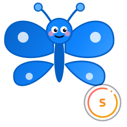

# Smooblue

A native, multi-column [Bluesky](https://bsky.app) client for macOS desktop. Written in Rust + [Dioxus](https://dioxuslabs.com/), backed by Bluesky's official OAuth flow (PAR + PKCE + DPoP-bound tokens).

<p align="center">
  
</p>

<p align="center">
  
</p>

<p align="center"><sub>
  GIF heavily downsampled to fit GitHub's inline limit. Full quality:
  <a href="media/smooblue-demo.mp4"><strong>▶ smooblue-demo.mp4 (1080p · 65 MB)</strong></a>
</sub></p>

---

## What it is

A TweetDeck-style desktop client for Bluesky. Stack as many columns as you want — Home, Notifications, Discover, your saved feeds, lists, search, individual profiles, suggested-follows — and watch them all live-update side-by-side. No app passwords; sign in once via OAuth and Smooblue holds DPoP-bound tokens on disk (0600, your config dir).

Built fast, single-binary, ~11 MB native app — feels closer to a Finder window than an Electron browser tab.

## Features

**Deck**
- Multi-column horizontal scrolling deck (Home / Notifications / Discover / custom feeds / lists / search / profile / suggested follows)
- Drag-to-reorder columns
- "Your feeds" — feed generators you've authored show up first in the column picker
- Paste any feed AT-URI to add a custom column
- Trending topic chips + popular-feeds browser
- Per-column close + persistent layout across launches
- Light + dark themes (token-based, brand colors preserved)

**Posts**
- Compose, reply, repost, like, quote, delete
- Self-threading (chain replies on submit)
- Image attachments (up to 4) with auto-generated alt-text (Apple Vision OCR + LLM scene description)
- **Drag-and-drop** images or video onto the compose sheet
- Video attachments (mp4 / mov / webm)
- Rich-text facets — @mentions, #hashtags, http links auto-detected + resolved
- ⌘↵ to submit
- Draft persisted across launches

**Read**
- Thread view — click any post body to open the conversation
- Click a notification to jump to the relevant post (or profile for follows)
- "Reposted by X" / "Replying to @Y" chips on every feed card
- Tap the timestamp on any post to open it on bsky.app in your browser
- "More" → copy bsky.app permalink to clipboard
- Engagement modals (likes / reposts / quotes) — tap a count on any post
- Content-warning interstitial for labeled (NSFW / graphic / sensitive) posts

**Profile**
- Your own profile view + edit (display name, bio, avatar, banner via file picker)
- Other profiles with follow / mute / block / report
- Pinned post displayed at the top with a chip
- "Followed by ... and X others you follow" mutuals row

**Accounts & moderation**
- Multi-account switching (sign into as many as you want, flip via Settings)
- Mute & block list management in Settings → Moderation
- Report flow with bsky's canonical moderation reasons

**Vim-style keyboard navigation**
- `j` / `k` next / previous post
- `h` / `l` previous / next column
- `gg` top of column, `G` bottom
- `g` then `h` / `n` / `d` / `s` / `p` for Home / Notifications / Discover / Suggested / Profile
- Space leader → `n` new post, `/` search, `s` settings, `f` saved feeds, `?` help, `1`–`9` jump to column N
- `?` toggles the keyboard help overlay
- Esc closes the topmost modal; ⌘K opens search anywhere

**Operational**
- Self-update notifier — checks GitHub releases on launch
- Optional system-level auto-updater (launchd job, hourly) that rebuilds + reinstalls from `main`
- macOS app activation done right — Cmd+Up / BetterSnapTool / Raycast hotkeys reach Smooblue without clicking the menu bar first

## Install

### macOS (supported)

```bash
git clone https://github.com/SmooAI/smooblue.git
cd smooblue
./scripts/bundle-macos.sh         # builds release + creates dist/Smooblue.app
cp -R dist/Smooblue.app /Applications/
xattr -dr com.apple.quarantine /Applications/Smooblue.app
open /Applications/Smooblue.app
```

Or stay current automatically (hourly rebuild + reinstall from `main`):

```bash
sed -e "s|@USER@|$USER|g" -e "s|@HOME@|$HOME|g" \
    scripts/ai.smoo.smooblue.updater.plist.template \
    > ~/Library/LaunchAgents/ai.smoo.smooblue.updater.plist
launchctl load ~/Library/LaunchAgents/ai.smoo.smooblue.updater.plist
```

The updater is a no-op when there are no new commits on `main` or your working tree is dirty — safe to leave running.

### Linux (untested but probably works)

Smooblue is a Dioxus desktop app — Dioxus uses `wry`, which on Linux renders via `webkit2gtk`. The core deck + OAuth flow should run; a few macOS-specific niceties degrade gracefully:

- Apple Vision OCR for auto-alt-text is macOS-only — alt text falls back to the LLM scene description.
- "Copy link" on a post uses `pbcopy`; you'll want to wire `xclip` / `wl-copy` (one-line patch in `crates/smooblue-app/src/components/post.rs`).
- `bundle-macos.sh` produces a macOS `.app` — for Linux you just run the binary directly (no bundling story written yet).

**Prerequisites** (Debian/Ubuntu names; pick your distro's equivalents):

```bash
sudo apt install \
    libwebkit2gtk-4.1-dev \
    libgtk-3-dev \
    libayatana-appindicator3-dev \
    librsvg2-dev \
    libssl-dev \
    build-essential
```

**Build + run:**

```bash
git clone https://github.com/SmooAI/smooblue.git
cd smooblue
cargo run --release -p smooblue-app
```

The release binary lands at `target/release/smooblue-app` — copy it wherever you keep local binaries (e.g. `~/.local/bin/smooblue`). The shared smooai-ui CSS + brand icon are baked into the binary at compile time, so a single file is the whole app.

A `.desktop` file + xdg auto-update story is a future pearl — PRs welcome.

### Windows (not yet)

Wry supports Windows via WebView2, so the core should build, but nobody's tried. The `safe_open` shell-out, the macOS activation hook, and the bundle script would all need a Windows arm.

## Privacy — what Smooblue sends where

| Data                      | Sent to                                  | When                                                                 |
| ------------------------- | ---------------------------------------- | -------------------------------------------------------------------- |
| Handle, password (typed)  | **Nowhere** — Bluesky handles auth       | Never; OAuth means Smooblue never sees your password                 |
| Bluesky access token      | Your PDS (which proxies to AppView)      | Every XRPC call                                                      |
| Session (DPoP key + tokens) | Local file (0600 in config dir)        | After sign-in; survives rebuilds (Keychain ACL was unreliable)        |
| Display name, handle, DID | **Smoo AI CRM** *(opt-in only)*          | Only if you tick "Stay in touch with Smoo AI" during sign-in         |

The Smoo AI CRM sync is off by default and reversible from Settings.

## Build from source

```bash
# requires Rust 1.80+
cargo run --release -p smooblue-app          # dev launch
cargo test --workspace --lib                  # unit tests (91 of them)
bash scripts/bundle-macos.sh                  # produces dist/Smooblue.app
bash scripts/build-icons.sh                   # regen PNG icons from icon.svg
```

Demo mode (no network, canned data — useful for screenshots):

```bash
SMOOBLUE_DEMO=1 cargo run -p smooblue-app
SMOOBLUE_DEMO=1 SMOOBLUE_DEMO_SCALE=large cargo run -p smooblue-app  # 500-post scale test
```

## Layout

```
smooblue/
├── crates/
│   ├── smooblue-app/      # Dioxus desktop binary + components
│   ├── smooblue-atproto/  # XRPC client (timeline, profile, notifs, feeds, ...)
│   ├── smooblue-crm/      # opt-in Smoo CRM sync
│   ├── smooblue-oauth/    # ATproto OAuth (PAR + PKCE + DPoP)
│   └── smooblue-theme/    # CSS tokens + shared sheet
├── assets/
│   ├── icons/             # generated PNG app icons (16 → 1024)
│   ├── icon.svg           # source SVG (Bluesky butterfly + smoo monogram chip)
│   └── styles.css         # smooblue-specific component CSS
├── media/
│   └── smooblue-demo.mp4  # demo recording
├── scripts/
│   ├── bundle-macos.sh
│   ├── build-icons.sh
│   ├── smooblue-update.sh
│   └── ai.smoo.smooblue.updater.plist.template
└── Cargo.toml             # Cargo workspace
```

## Roadmap

- DMs (`chat.bsky.*`)
- Pinned posts ordering inside a thread sheet
- Trending topics → live deep-link to bsky search
- Cross-platform builds (Linux / Windows) — code is portable, just needs CI

## Contributing

Issues and PRs welcome — see [CONTRIBUTING.md](CONTRIBUTING.md).

## License

[MIT](LICENSE) © [Smoo AI](https://smoo.ai)

---

*Smooblue is not affiliated with Bluesky Social, PBC. "Bluesky" and the Bluesky butterfly are trademarks of Bluesky Social, PBC.*
